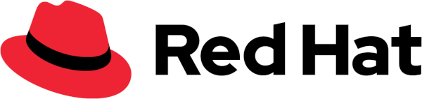

# test-site-feature
testing the Github site feature

| First Header  | Second Header |
| ------------- | ------------- |
| Content Cell  | Content Cell  |
| Content Cell  | Content Cell  |

<!DOCTYPE html>
<html>
<title>Austria Red Hat 2024 Community Days</title>
<meta name="viewport" content="width=device-width, initial-scale=1">
<link rel="stylesheet" href="w3.css">
<body>

  
  <h2>Austria Red Hat 2024 Community Days</h2> 

  <h5>Willkommen zu den Österreichischen Red Hat Community Terminen</h5> 

  

      

  
      <table class="w3-table w3-bordered w3-striped">
      <tr class="w3-blue">
        <th>Datum</th>
        <th>Veranstaltung</th>
        <th>Hinweise</th>
      </tr>

      <tr>
        <td>3. od. 4. Do. im Monat</td>
        <td>Red Hat Austria & Friends </td>
        <td>Einladung / Organisation Stephan Kraft</td>
      </tr>

      <tr>
        <td>16. Mai</td>
        <td><a href="https://www.brz.gv.at/wie-wir-arbeiten/Kontakt-aufnehmen/veranstaltungen/20240516-Austrian-Plattform-Engineering-Community.html" target="_blank">Platform Engineering Community</a>&nbsp;@BRZ 
        <td></td>
      </tr>

      <tr>
        <td>6. Juni</td>
        <td><a href="https://forms.gle/LizKrbWG6ZUzgn1S6" target="_blank">OpenShift Virtualization - Hands-on Workshop</a>&nbsp;Red Hat Wien 
        <td> 13:30 - 17:00, Tech Requirements: Bring Your Own Device, Nur Browser erforderlich (keine lokale Installation!)</td>
      </tr>

      <tr>
        <td>12. Juni</td>
        <td>Das ist das zweite Meetup der <a href="https://www.meetup.com/de-DE/keycloak-user-group-austria/events/" target="_blank">Keycloak User Group Austria</a>&nbsp;Millennium Tower, Wien</td>
        <td>Kontakt Stephan Kraft</td>
      </tr>

      <tr>
        <td>13.-15. Juni</td>
        <td><a href="https://www.devconf.info/cz/" target="_blank">DevConf.CZ 2024</a> 
        <td></td>
      </tr>

      <tr>
        <td>20. Juni</td>
        <td><a href="https://events.redhat.com/profile/form/index.cfm?PKformID=0x1056344abcd" target="_blank">Ansible Automates</a>&nbsp;Wien 
        <td>Novotel Wien Hauptbahnhof</td>
      </tr>

      <tr>
        <td>10. Sept.</td>
        <td><a href="https://www.openshift-anwender.de/" target="_blank">26. OpenShift Anwendertreffen @ voestalpine</a>&nbsp;Linz, Austria</td>
        <td>Kontakt Stephan Kraft</td>
      </tr>

      <tr>
        <td>8.-10. Okt.</td>
        <td><a href="https://kcdaustria.at/" target="_blank">Kubernetes & Cloud Native community</a>&nbsp;Vienna, Austria Call for proposals bis 22. Juni</td>
        <td></td>
      </tr>

      </table>
  
  

  

      

  
      <table class="w3-table w3-bordered w3-striped">
      <tr class="w3-blue">
        <th>Datum</th>
        <th>Vergangenge Veranstaltungen</th>
        <th>Hinweise</th>
      </tr>
      
      <tr>
        <td>28. Februar</td>
        <td><a href="https://www.ansible-anwender.de/" target="_blank">5. Ansible Anwendertreffen</a>&nbsp;Frankfurt am Main, Deutschland</td>
        <td></td>
      </tr>

      <tr>
        <td>7. März</td>
        <td>FIWARE Community Treffen <a href="https://wirtschaftsagentur.at/termine-events-workshops/fiware-community-treffen/" target="_blank">Anmeldung und Details über die Wirtschaftsagentur Wien</a>&nbsp;FH Technikum, Wien</td>
        <td>Kontakt David Hanacek</td>
      </tr>
      
      <tr>
        <td>19. März</td>
        <td>Das ist das erste Meetup der <a href="https://www.meetup.com/de-DE/keycloak-user-group-austria/events/297881850/" target="_blank">Keycloak User Group Austria</a>&nbsp;Millennium Tower, Wien</td>
        <td>Kontakt Stephan Kraft</td>
      </tr>

      <tr>
        <td>19.-22. März</td>
        <td><a href="https://events.linuxfoundation.org/kubecon-cloudnativecon-europe/" target="_blank">#KUBECON + #CLOUDNATIVECON Europe 2024</a>&nbsp;Paris, Frankreich</td>
        <td>Robert Baumgartner ist vor Ort</td>
      </tr>
      
      <tr>
        <td>4. April</td>
        <td><a href="https://events.redhat.com/profile/form/index.cfm?PKformID=0x1048193abcd" target="_blank">Cloud-native Virtualisierung mit OpenShift Workshop</a>, Wien</td>
        <td>OpenShift Virtualisierung live kennenlernen (Vormittag) und am Nachmittag hands-on ausprobieren</td>
      </tr>

      <tr>
        <td>25. April</td>
        <td><a href="https://www.toechtertag.at/betrieb/redhat/" target="_blank">Wiener Töchtertag 2024</a></td>
        <td></td>
      </tr>

      <tr>
        <td>7. Mai</td>
        <td>OpenShift Virtualization - Hands-on Workshop&nbsp;Red Hat Wien 
        <td></td>
      </tr>

      <tr>
        <td>5.-9. Mai</td>
        <td><a href="https://www.redhat.com/en/summit" target="_blank">Red Hat Summit and AnsibleFest</a>&nbsp;Denver, US 
        <td>Aufzeichnungen und Highlights auf <a href="https://tv.redhat.com/static/summit" target="_blank">Red Hat TV</a>, <a href="https://www.youtube.com/watch?v=eHtaDeEwVPk" target="_blank">YouTube</a> und im <a href="https://www.redhat.com/en/about/red-hat-summit-newsroom" target="_blank">Red Hat Summit Newsroom</a></td>
      </tr>

      

      </table>
  
  
  
  

    <h5>Mehr Community und Entwickler Quellen</h5> 
  
  

  

    <ul>
      <li><a href="https://www.redhat.com/">Red Hat</a></li>
      <li>Try out <a href="https://developers.redhat.com/">Red Hat Developer</a></li>
      <li><a href="https://openpracticelibrary.com/" target="_blank">Open Practice Library</a> - DevOps and product development practices for running workshops and learning about the discovery and delivery of software</li>
      <li><a href="https://www.redhat.com/en/interactive-labs" target="_blank">Red Hat interactive labs</a> - Red Hat Enterprise Linux, Openshift and Ansible Automation Platform labs</li>
      <li><a href="https://access.redhat.com/articles/7052429" target="_blank">Red Hat OpenShift Library</a> - single, easily-accessible repository to access prescribed assets and offers at every stage of the product life cycle</li>
      <li><a href="https://learn.openshift.com" target="_blank">learn.openshift.com</a> - Guided demos of new features on a real cluster</li>
      <li><a href="https://try.openshift.com" target="_blank">try.openshift.com</a> - OpenShift info, documentation and more</li>
      <li><a href="https://www.redhat.com/en/whats-new-red-hat-openshift" target="_blank">What's new in Red Hat OpenShift</a> - Join our Red Hat OpenShift product managers for in-depth overviews of Red Hat OpenShift releases.</li>
      <li><a href="https://calendar.google.com/calendar/u/0/embed?src=redhatstreaming@gmail.com" target="_blank">Weitere OpenShift-Livestream-Events über Google Kalender</a> (bitte auf Zeitzone achten)</li>
      <li><a href="https://commons.openshift.org" target="_blank">commons.openshift.org</a> - OpenShift Commons: Where users, partners, and contributors come together</li>
    </ul>
  
  

  <h5>Euer Red Hat Austria Community Team</h5> 

  

  

    

        
        

          <h3>Robert Baumgartner</h3>
          Senior Specialist Solution Architect 
        

    

    

  

  

    

        
        

          <h3>David Hanacek</h3>
          Senior Solution Architect 
        

    

    

  

  

    

        
        

          <h3>Stephan Kraft</h3>
          Software Developer Advocate 
        

    

    

  

  

    

        
        

          <h3>Stephan Neubauer</h3>
          Sales Account Manager 
        

    

    

  

</body>
</html>
